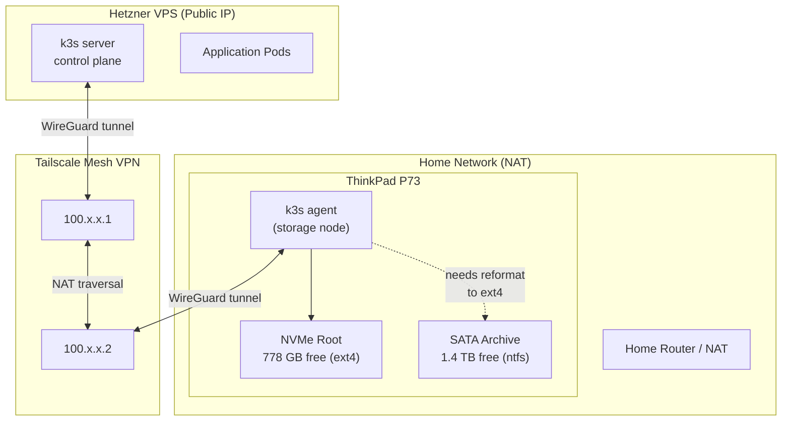
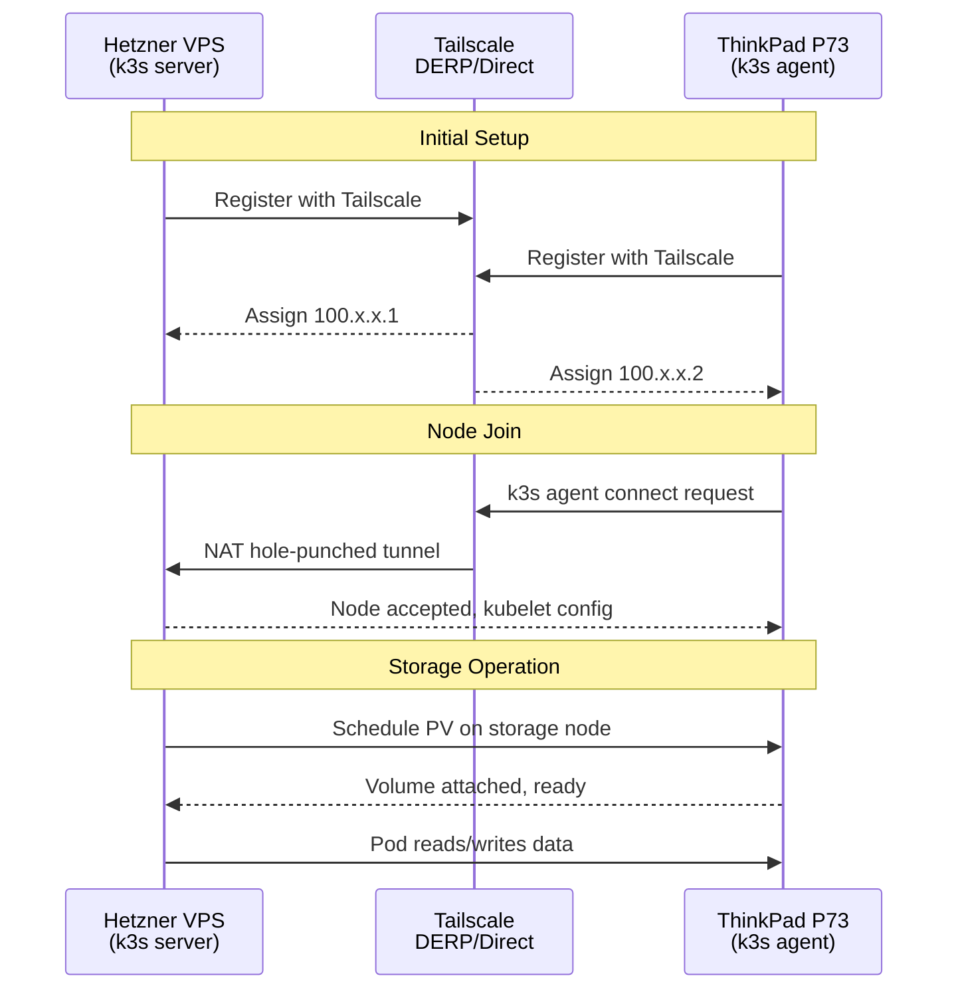
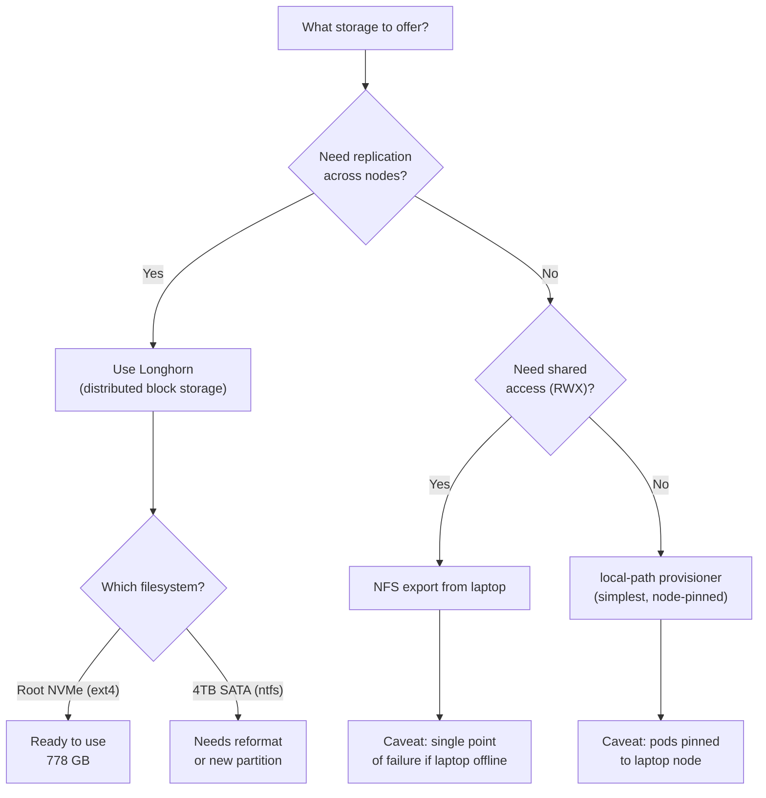
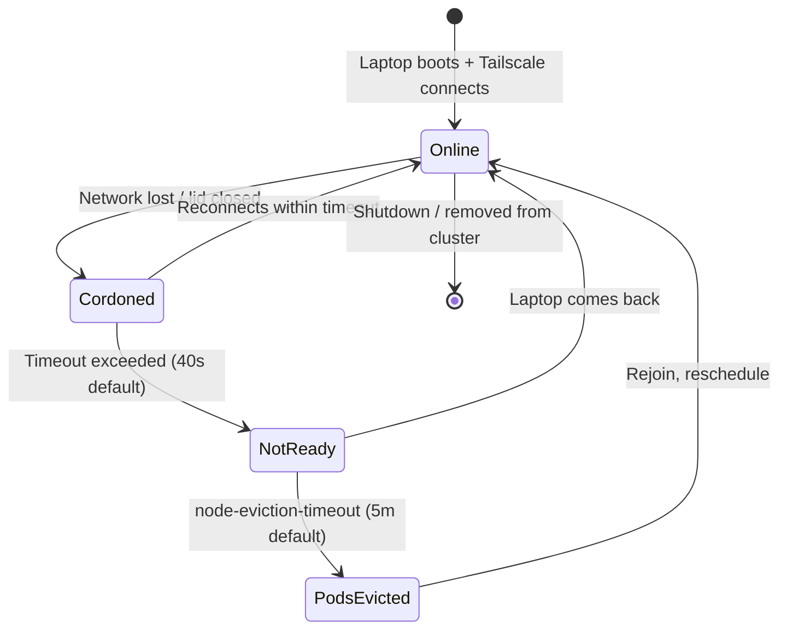

# K3s Hybrid Cluster — Hetzner VPS + ThinkPad P73

## Overview

Join the local ThinkPad P73 as a storage worker node to an existing k3s cluster running on a Hetzner VPS. The laptop provides ~2.2 TB of usable storage to the cluster over a Tailscale VPN mesh.

## Architecture



## Network Topology



## Setup Steps

### 1. Install Tailscale on Both Machines

```bash
# On Hetzner VPS
curl -fsSL https://tailscale.com/install.sh | sh
tailscale up --advertise-tags=tag:k3s-server

# On ThinkPad
curl -fsSL https://tailscale.com/install.sh | sh
tailscale up --advertise-tags=tag:k3s-agent
```

### 2. Configure k3s Server (Hetzner VPS)

```bash
# Get Tailscale IP
TAILSCALE_IP=$(tailscale ip -4)

# Start k3s server with Tailscale VPN integration
curl -sfL https://get.k3s.io | INSTALL_K3S_EXEC="server \
  --node-external-ip=$TAILSCALE_IP \
  --flannel-backend=wireguard-native \
  --flannel-external-ip" sh -

# Retrieve the node token
cat /var/lib/rancher/k3s/server/node-token
```

### 3. Join ThinkPad as Worker Node

```bash
TAILSCALE_IP=$(tailscale ip -4)
SERVER_TAILSCALE_IP="<server-tailscale-ip>"
NODE_TOKEN="<token-from-server>"

curl -sfL https://get.k3s.io | INSTALL_K3S_EXEC="agent \
  --server https://$SERVER_TAILSCALE_IP:6443 \
  --token $NODE_TOKEN \
  --node-external-ip=$TAILSCALE_IP \
  --node-label role=storage \
  --node-taint role=storage:NoSchedule" sh -
```

### 4. Prepare Storage

```bash
# The root NVMe has 778 GB free — use a dedicated directory
sudo mkdir -p /opt/k3s-storage
sudo chown root:root /opt/k3s-storage

# Optional: if reformatting a partition on the 4TB for ext4
# sudo mkfs.ext4 /dev/sda2    # WARNING: destroys all data on Arxv
# Or shrink NTFS and create a new ext4 partition alongside it
```

### 5. Install Longhorn

```bash
# On the machine with kubectl access
kubectl apply -f https://raw.githubusercontent.com/longhorn/longhorn/v1.6.0/deploy/longhorn.yaml

# Configure the laptop node's storage path
kubectl patch nodes <laptop-node-name> --type merge -p \
  '{"metadata":{"annotations":{"node.longhorn.io/default-disks-config":"[{\"path\":\"/opt/k3s-storage\",\"allowScheduling\":true}]"}}}'
```

## Storage Decision Tree



## Reliability Considerations



### Mitigations

| Risk | Mitigation |
|------|-----------|
| Laptop sleeps | Disable sleep when on AC: `systemd-inhibit --what=sleep` or configure in BIOS |
| WiFi drops | Use ethernet when possible; Tailscale reconnects automatically |
| Power outage | Longhorn replicas on VPS survive; data on laptop unavailable until back |
| Single CPU core | Taint node for storage-only; kubelet itself uses ~100-200MB RAM, minimal CPU |
| Slow upload | Only suitable for bulk/archival storage, not latency-sensitive workloads |

## Recommended Node Labels and Taints

```yaml
# Applied during k3s agent install or via kubectl
labels:
  role: storage
  topology.kubernetes.io/zone: home
  node.kubernetes.io/instance-type: thinkpad-p73

taints:
  - key: role
    value: storage
    effect: NoSchedule
```

Pods that want to use this node must tolerate the taint:

```yaml
tolerations:
  - key: "role"
    operator: "Equal"
    value: "storage"
    effect: "NoSchedule"
nodeSelector:
  role: storage
```

## Prevent Laptop Sleep While Node is Active

```bash
# Add to systemd service or cron
systemd-inhibit --what=sleep --who=k3s --why="k3s storage node active" sleep infinity &

# Or disable sleep on AC power via logind.conf
# /etc/systemd/logind.conf
# HandleLidSwitchExternalPower=ignore
```
