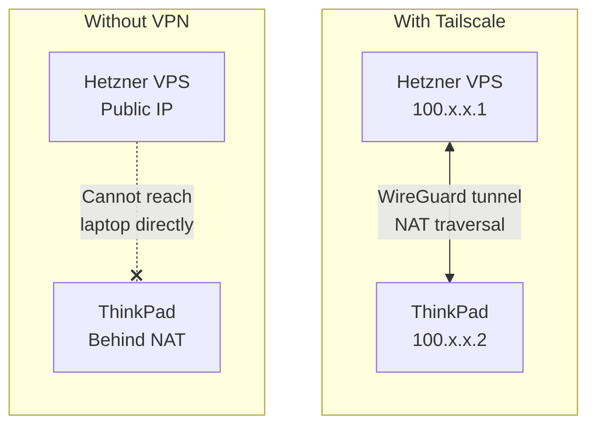
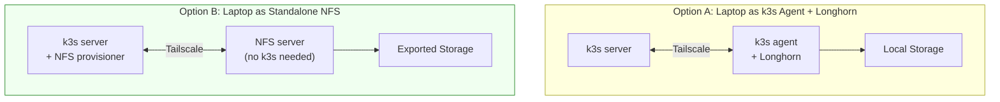
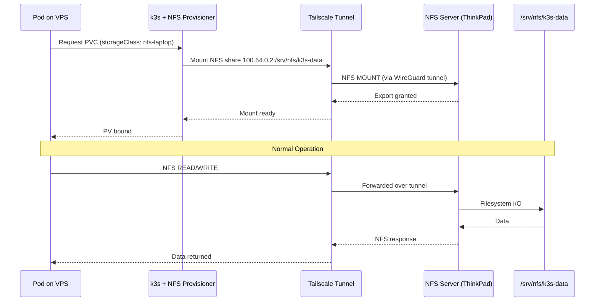
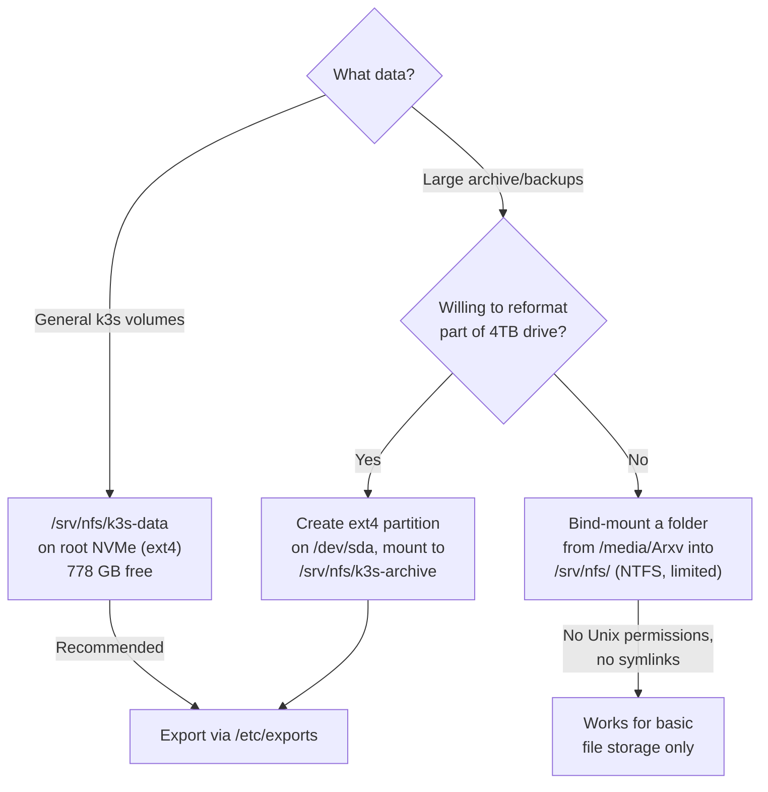

# NFS Storage Node — ThinkPad P73 to K3s Cluster

Follow-up to [k3s-hybrid-cluster.md](k3s-hybrid-cluster.md). This covers using the laptop purely as an NFS server rather than joining it as a k3s node.

## Do You Need Tailscale?

**Yes, you still need a VPN tunnel** (Tailscale, WireGuard, etc.) because:



- The laptop sits behind your home router (NAT) — the VPS cannot initiate connections to it
- NFS requires a **routable IP** between server and client — it has no NAT traversal of its own
- Tailscale gives both machines stable IPs on a private mesh (100.x.x.0/24) with automatic NAT hole-punching
- Unlike joining as a k3s node, **you don't need k3s agent on the laptop** — just Tailscale + NFS server

## Architecture Comparison



Option B is **simpler** — fewer moving parts, no kubelet overhead on the laptop, and the laptop doesn't need to run k3s at all.

## Setup

### Step 1: Tailscale (both machines)

```bash
# On both Hetzner VPS and ThinkPad
curl -fsSL https://tailscale.com/install.sh | sh
tailscale up
```

Note the Tailscale IPs:
```bash
tailscale ip -4  # e.g., 100.64.0.1 (VPS), 100.64.0.2 (laptop)
```

### Step 2: NFS Server (ThinkPad)

```bash
# Install NFS server
sudo apt install nfs-kernel-server

# Create export directory
sudo mkdir -p /srv/nfs/k3s-data
sudo chown nobody:nogroup /srv/nfs/k3s-data
sudo chmod 777 /srv/nfs/k3s-data

# Export to the VPS Tailscale IP only
echo "/srv/nfs/k3s-data  100.64.0.1/32(rw,sync,no_subtree_check,no_root_squash)" \
  | sudo tee -a /etc/exports

# Apply and start
sudo exportfs -ra
sudo systemctl enable --now nfs-kernel-server
```

### Step 3: Verify NFS from VPS

```bash
# On the Hetzner VPS
sudo apt install nfs-common

# Test mount
sudo mount -t nfs 100.64.0.2:/srv/nfs/k3s-data /mnt
ls /mnt
sudo umount /mnt
```

### Step 4: NFS Provisioner in k3s

Install the NFS subdir external provisioner via Helm so k3s can dynamically create PersistentVolumes on the laptop's NFS share:

```bash
# On the VPS (where kubectl works)
helm repo add nfs-subdir-external-provisioner \
  https://kubernetes-sigs.github.io/nfs-subdir-external-provisioner/

helm install nfs-provisioner nfs-subdir-external-provisioner/nfs-subdir-external-provisioner \
  --set nfs.server=100.64.0.2 \
  --set nfs.path=/srv/nfs/k3s-data \
  --set storageClass.name=nfs-laptop \
  --set storageClass.defaultClass=false
```

### Step 5: Use It

```yaml
# Example PersistentVolumeClaim
apiVersion: v1
kind: PersistentVolumeClaim
metadata:
  name: my-data
spec:
  storageClassName: nfs-laptop
  accessModes:
    - ReadWriteMany      # NFS supports RWX
  resources:
    requests:
      storage: 50Gi
```

## Full Data Flow



## Where to Store Data on the Laptop



**Recommendation:** Use the root NVMe (ext4) for the NFS export. NTFS lacks proper Unix permission support, which causes issues with containers expecting POSIX semantics.

## Performance Expectations

| Factor | Impact |
|--------|--------|
| **Direct Tailscale connection** | Best case: adds ~1-2ms latency over the base internet path |
| **Relayed connection (DERP)** | Worse: 50-200ms+ latency — avoid for NFS |
| **Home upload speed** | Bottleneck for writes from VPS to laptop; fine for reads if download is fast |
| **NFS over WAN** | Acceptable for bulk storage, backups, media; not for databases or high-IOPS workloads |
| **Single CPU core** | NFS server itself is lightweight — not a concern |

To check if your connection is direct or relayed:
```bash
tailscale status  # Look for "direct" vs "relay" next to the peer
```

## Laptop Availability

Unlike the k3s agent approach, if the laptop goes offline the cluster itself is unaffected — only pods using `nfs-laptop` volumes will hang on I/O until the laptop returns. To handle this gracefully:

```bash
# Prevent sleep while NFS is serving
sudo systemd-inhibit --what=sleep --who=nfs --why="NFS storage active" sleep infinity &

# Or in /etc/systemd/logind.conf
HandleLidSwitchExternalPower=ignore
```

Consider mounting NFS with soft timeout on the VPS side so pods get errors instead of hanging indefinitely:

```yaml
# In the Helm values or StorageClass
mountOptions:
  - soft
  - timeo=30
  - retrans=3
```
